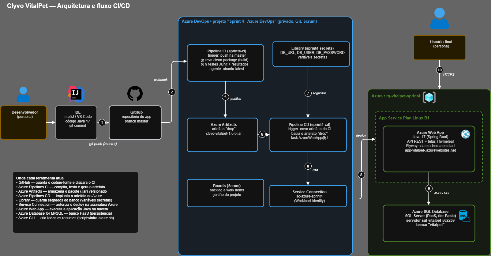

# Clyvo VitalPet — Sprint 4 (DevOps Tools & Cloud Computing)

Aplicação de gestão veterinária em **Java 17 + Spring Boot**, publicada no **Azure Web App** com banco **Azure SQL Database (PaaS)** e entrega contínua feita por pipelines de **CI/CD no Azure DevOps**.

## Links da entrega

| Item | Link |
|---|---|
| Repositório GitHub | `<URL deste repositório>` |
| Projeto no Azure DevOps | `https://dev.azure.com/<organização>/Sprint%204%20-%20Azure%20DevOps` |
| Vídeo no YouTube | `<URL do vídeo>` |
| Aplicação em produção | `https://app-vitalpet-<RM>.azurewebsites.net` |
| Swagger | `https://app-vitalpet-<RM>.azurewebsites.net/swagger-ui.html` |

## Integrantes

| Integrante | RM | Turma |
|---|---|---|
| João Victor Alcantara | RM562707 | `<2TDS...>` |
| Phillipo Barbosa | RM565399 | `<2TDS...>` |
| Eduardo Martins | RM562259 | `<2TDS...>` |
| Leonardo Aragaki Rodrigues | RM562944 | `<2TDS...>` |

## Descrição da solução

O **Clyvo VitalPet** acompanha o pet **depois** da consulta. Ao finalizar um atendimento, o sistema cria automaticamente um **acompanhamento clínico** e um **alerta de retorno**; ao resolver o alerta, o acompanhamento é concluído junto. A aplicação gerencia clínicas, veterinários, tutores, pets, consultas, acompanhamentos e alertas, com login e permissões por perfil (`ADMIN` e `VETERINARIO`), além de uma API REST documentada com Swagger.

**Benefícios para o negócio:** centraliza os dados da clínica, reduz a perda de informação após o atendimento, gera retornos automaticamente, isola o que cada veterinário pode ver e oferece um dashboard de indicadores.

## Stack

| Camada | Tecnologia |
|---|---|
| Linguagem / framework | Java 17, Spring Boot 3.3.5 (Web, Data JPA, Validation, Cache, Security, Thymeleaf) |
| Banco de dados (nuvem) | **Azure SQL Database** (PaaS) |
| Migrations | Flyway |
| Testes | JUnit 5, Spring Boot Test, Spring Security Test |
| Build | Maven (com Maven Wrapper) |
| Hospedagem | Azure App Service (Web App Linux, Java 17) |
| Código-fonte | GitHub (branch `master`) |
| CI/CD | Azure DevOps (Azure Pipelines em YAML, agente self-hosted, Artifacts, Library, Service Connection) |
| Infraestrutura | Azure CLI (`scripts/infra-azure.sh`) |

## Arquitetura e fluxo CI/CD



| # | Etapa |
|---|---|
| 1 | O desenvolvedor faz commit e push na branch `master` do GitHub |
| 2 | O push dispara automaticamente a pipeline de **CI** (`sprint4-ci`) |
| 3 | CI: `mvn clean package` (build) |
| 4 | CI: execução dos testes automatizados (JUnit) e publicação dos resultados |
| 5 | CI: publicação do artefato `drop` (`clyvo-vitalpet-1.0.0.jar`) no Azure Artifacts |
| 6 | Um novo artefato dispara automaticamente a pipeline de **CD** (`sprint4-cd`) |
| 7 | O CD lê as credenciais do banco na Library (`sprint4-secrets`, variáveis secretas) |
| 8 | O CD faz o deploy no **Azure Web App** usando a Service Connection `sc-azure-sprint4` |
| 9 | O Web App se conecta ao **Azure SQL Database** por JDBC com SSL (o Flyway cria o schema no primeiro start) |
| 10 | O usuário final acessa a aplicação por HTTPS |

## Pipelines (Azure DevOps)

| Pipeline | Arquivo | Gatilho | O que faz |
|---|---|---|---|
| `sprint4-ci` | [`azure-pipelines-ci.yml`](azure-pipelines-ci.yml) | Push na `master` (alterações em README, `docs/` e `assets/` são ignoradas) | Build com Maven, testes JUnit com resultados publicados na aba **Tests**, publicação do artefato `drop` |
| `sprint4-cd` | [`azure-pipelines-cd.yml`](azure-pipelines-cd.yml) | Conclusão do `sprint4-ci` com novo artefato | Baixa o artefato, aplica as configurações do app e faz o deploy no Azure Web App |

**Dados sensíveis:** `DB_URL`, `DB_USER` e `DB_PASSWORD` ficam no variable group `sprint4-secrets` da Library, marcados como **secretos**. Eles nunca aparecem no código nem nos logs, e chegam à aplicação como variáveis de ambiente (`SPRING_DATASOURCE_*`) pelo CD.

## Banco de dados

- Em **nuvem**: Azure SQL Database, banco `vitalpet`.
- O schema e a massa de dados (2 clínicas, 3 veterinários, 3 tutores, 4 pets, 5 consultas, acompanhamentos, alertas e 2 usuários) são criados pelo **Flyway** a partir de `src/main/resources/db/migration-sqlserver/`.
- Em desenvolvimento local e nos testes, o perfil padrão usa **H2 em memória** (`src/main/resources/db/migration/`). O H2 **não** é usado na nuvem.
- Tabelas: `clinicas`, `veterinarios`, `tutores`, `pets`, `consultas`, `acompanhamentos`, `alertas`, `usuarios`.

## Como reproduzir o ambiente

### 1. Criar a infraestrutura (Azure CLI)

No Azure Cloud Shell (Bash), edite `RM` e `LOCATION` no topo do script e execute:

```bash
bash scripts/infra-azure.sh
```

O script cria o Resource Group `rg-vitalpet-sprint4`, o Azure SQL Server com o banco `vitalpet` (tier Basic), o App Service Plan Linux B1 e o Web App `app-vitalpet-<RM>` (Java 17), e imprime os valores de `DB_URL`, `DB_USER` e `DB_PASSWORD`.

### 2. Configurar o Azure DevOps

1. Criar o projeto **Sprint 4 - Azure DevOps** (privado, Git, Scrum) e convidar o professor com acesso **Basic**.
2. Criar a Service Connection **`sc-azure-sprint4`** (Azure Resource Manager, Workload Identity federation).
3. Criar na Library o variable group **`sprint4-secrets`** com `DB_URL`, `DB_USER` e `DB_PASSWORD` (todas secretas).
4. Registrar um **agente self-hosted** no pool `Default` (Organization settings → Agent pools → Default → New agent), com `JAVA_HOME_21_X64` definido. Com agente Microsoft-hosted, troque `pool` por `vmImage: ubuntu-latest` nos dois YAML.
5. Criar a pipeline **`sprint4-ci`** a partir de `azure-pipelines-ci.yml` e a pipeline **`sprint4-cd`** a partir de `azure-pipelines-cd.yml`.

### 3. Fazer o deploy

Qualquer push na `master` dispara o CI e, em seguida, o CD:

```bash
git add .
git commit -m "feat: minha alteracao"
git push origin master
```

## Executar localmente (H2)

```bash
./mvnw spring-boot:run          # Linux/macOS
.\mvnw.cmd spring-boot:run      # Windows
```

A aplicação sobe em `http://localhost:8080` com H2 em memória e as migrations de `db/migration`.

## Testes automatizados

```bash
./mvnw test
```

| Teste | O que valida |
|---|---|
| `ClyvoVitalpetApplicationTests` | O contexto sobe com Flyway e validação do schema pelo Hibernate |
| `SecurityConfigTest` | Login obrigatório em `/web/**`, autorização por perfil e API REST aberta |
| `AlertaServiceTest` | Resolver um alerta conclui o acompanhamento vinculado |

No CI, os testes rodam a cada push e os resultados aparecem na aba **Tests** da execução.

## Acesso à aplicação web

Acesse `/web/login` com um dos usuários de demonstração:

| Perfil | E-mail | Senha |
|---|---|---|
| ADMIN | `admin@vitalpet.com.br` | `VitalPet@123` |
| VETERINARIO | `ana.souza@vitalpet.com.br` | `VitalPet@123` |

| Área | ADMIN | VETERINARIO |
|---|---|---|
| Dashboard | ✅ | ✅ |
| Clínicas, Veterinários, Tutores | ✅ CRUD completo | 🚫 sem acesso |
| Pets | ✅ CRUD completo | ✅ CRUD completo |
| Consultas | ✅ todas | ✅ apenas as próprias |
| Alertas | ✅ | ✅ |

## API REST (CRUD) e Swagger

A API (`/api/**`) é pública e documentada em `/swagger-ui.html`.

```text
POST   /api/clinicas
GET    /api/clinicas/{id}
GET    /api/clinicas?nome=vet&page=0&size=10&sortBy=nome&direction=asc
PUT    /api/clinicas/{id}
DELETE /api/clinicas/{id}          (exclusão lógica: marca ativa = false)
PATCH  /api/clinicas/{id}/ativar
```

Os mesmos padrões valem para `/api/tutores`, `/api/pets`, `/api/veterinarios`, `/api/consultas`, `/api/acompanhamentos`, `/api/alertas` e `/api/dashboard/resumo`.

Exemplo de `POST /api/clinicas`:

```json
{
  "nome": "Clínica VitalPet Demo",
  "endereco": "Rua da Demonstração, 100",
  "cidade": "São Paulo",
  "estado": "SP",
  "cep": "01310000",
  "telefone": "11999990000",
  "email": "demo@vitalpet.com",
  "cnpj": "12345678000199"
}
```

Consultas para conferir a persistência no banco:

```sql
SELECT id, nome, cnpj, telefone, ativa FROM clinicas ORDER BY id DESC;
SELECT version, description, success FROM flyway_schema_history;
```

## Estrutura do repositório

```text
├── azure-pipelines-ci.yml        # Pipeline de CI
├── azure-pipelines-cd.yml        # Pipeline de CD
├── scripts/infra-azure.sh        # Criação dos recursos Azure via CLI
├── docs/arquitetura-DevOps.png   # Diagrama da arquitetura + fluxo CI/CD
├── src/main/java/...             # Código da aplicação
├── src/main/resources/
│   ├── application.properties          # Perfil padrão (H2, local e testes)
│   ├── application-sqlserver.properties # Perfil da nuvem (Azure SQL Database)
│   ├── db/migration/                   # Migrations H2
│   └── db/migration-sqlserver/         # Migrations T-SQL (Azure SQL)
└── src/test/java/...             # Testes automatizados
```
